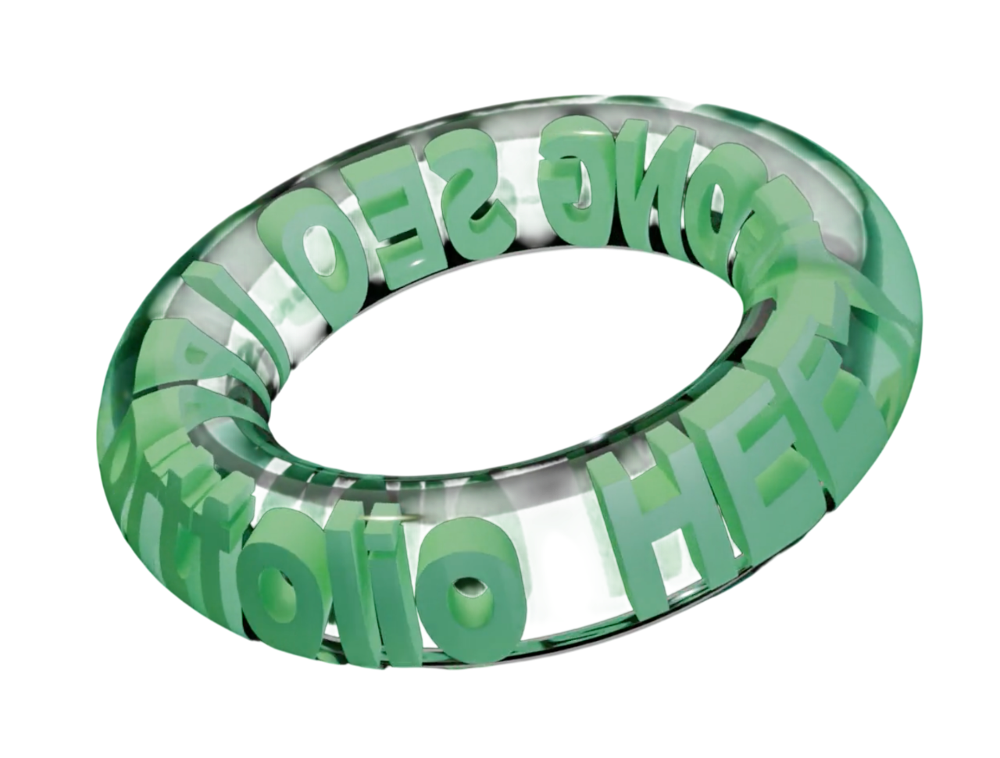
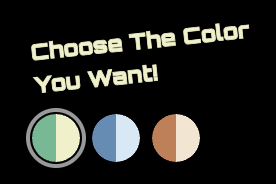

# 🧑‍💻 Portfolio Website

## 📌 프로젝트 소개

Blender를 이용한 3D 애니메이션과 인터랙티브 UI를 활용한
풀스택 개발자 포트폴리오입니다.
프로젝트 경험, 기술 스택, 트러블슈팅, 연락처를 담고 있으며
다크/라이트 모드와 3가지 컬러 테마를 지원합니다.

<br />

<div align="center">
  
  
</div>

<br />

## 🛠 Tech Stack

| 분류       | 기술                                                                                                                                    |
| ---------- | --------------------------------------------------------------------------------------------------------------------------------------- |
| Language   |  TypeScript        |
| Framework  |  React 19                    |
| Build Tool |  Vite                          |
| Styling    |  Tailwind CSS 4  |
| State      | 🐻 Zustand                                                                                                                              |
| Animation  |  Framer Motion |
| Email      | 📧 EmailJS                                                                                                                              |
| Deployment |  Vercel                    |

<br />

## 📁 프로젝트 구조

```
src/
├── components/
│   ├── ui/          # 재사용 UI 컴포넌트
│   └── sections/    # 페이지별 섹션 컴포넌트
├── pages/           # 라우팅 단위 페이지
├── store/           # Zustand 전역 상태
├── hooks/           # 커스텀 훅
└── index.css        # Tailwind 4 테마 변수 정의
```

<br />

## 🗂 페이지 구성

### Landing

- 3D 툴 **Blender**로 직접 제작한 애니메이션 사용
- 제작 참고: [SENS 3D](https://www.youtube.com/@sens_3d) (YouTube)

### Home

- **About**: 프로필 / 랩탑 이미지 토글 애니메이션, 자기소개
- **Skills**: 기술 스택 아이콘 무한 스크롤 마퀴
- **Contact**: 이메일 · GitHub · Tistory 링크

### Projects

- 프로젝트 카드 캐러셀 (Framer Motion 레이아웃 애니메이션)
- 선택된 카드가 중앙 확대 표시

### 프로젝트 상세 페이지

각 프로젝트 페이지에서 모달로 아래 정보 제공:

| 모달       | 내용                                       |
| ---------- | ------------------------------------------ |
| 기술 스택  | 카테고리별 아이콘 + 이름                   |
| 담당 업무  | 탭별 업무 내용 + 스크린샷 슬라이드쇼       |
| 트러블슈팅 | 문제 상황 · 원인 · 해결 · 성과 (코드 포함) |
| 발표 자료  | PDF 뷰어 + 시연 영상 (YouTube 임베드)      |

### About

- 전문 소개 페이지 (배경 프로필 이미지 + 바이오 텍스트)

### Contact

- EmailJS 기반 이메일 직접 전송 폼

<br />

## ✨ 주요 기능

### 1. 테마 시스템

- **3가지 컬러 테마**: Green / Blue / Warm
- **다크 / 라이트 모드** 토글
- CSS 변수(`--color-primary` 등)와 `data-theme`, `data-mode` 속성 기반으로 전체 UI 색상 동기화
- `localStorage`에 테마 / 모드 저장 → 페이지 재방문 시 복원

```css
/* 예시: index.css */
[data-theme="blue"] {
  --color-primary: #5b8db8;
}
[data-mode="light"] {
  --color-bg: #f1f3f5;
  --color-text: #111111;
}
```

### 2. 프로젝트 캐러셀

- Framer Motion `layoutId` 기반 부드러운 카드 이동 애니메이션
- 중앙 카드 강조 (양쪽 카드 opacity/scale 감소)

### 3. 이미지 슬라이드쇼

- 담당 업무 모달 내 이전/다음 버튼 + 닷 인디케이터 슬라이드쇼

### 4. 트러블슈팅 문서화

- Before / After 코드 블록 포함한 상세 트러블슈팅 기록
- 각 프로젝트별 2~3개 이슈 수록

### 5. 반응형 디자인

| 범위       | 레이아웃                      |
| ---------- | ----------------------------- |
| 320–767px  | 단일 컬럼, 중앙 정렬          |
| 768–1023px | 2컬럼, 균형 간격              |
| 1024px+    | 다중 컬럼, 절대 위치 레이아웃 |

### 6. 라우팅 (React Router 미사용)

- Zustand `currentPage` 상태로 페이지 전환
- `AnimatePresence` fade 트랜지션 (0.5s)

<br />

## 🎨 디자인 시스템

| 이름       | 다크 (Green 기준) | 라이트 (Green 기준) |
| ---------- | ----------------- | ------------------- |
| Primary    | `#61BA91`         | `#2d7058`           |
| Secondary  | `#EFF1C5`         | `#4a4860`           |
| Background | `#000000`         | `#f1f3f5`           |
| Surface    | `#111111`         | `#ffffff`           |
| Text       | `#ffffff`         | `#111111`           |

- 타이포그래피: **Orbitron** (제목/헤딩), 기본 sans-serif (본문)
- Glass UI: `backdrop-blur` + 20–30% 투명도 오버레이

<br />

## ⚙️ 환경 변수

EmailJS 사용을 위해 `.env` 파일 설정이 필요합니다.
<br />

## 🚀 실행 방법

```bash
npm install
npm run dev      # 개발 서버
npm run build    # 빌드
npm run preview  # 빌드 미리보기
```
